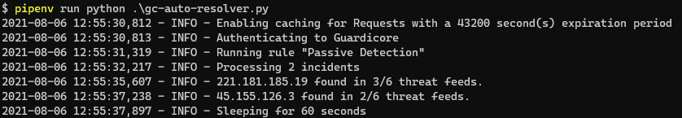

# Guardicore Incident Auto Resolver

This tool automatically resolves Guardicore Incidents in the Centra UI based on a set of rules defined in `config.yml`



## Getting started

1. Rename `config.yml.sample` to `config.yml`
2. Add your Guardicore management url
3. Add your API accounts credentials
4. Define your rules
5. Define your threat feeds
6. Run the tool

### Feature Checklist

- [ ] Dockerized version
- [x] Enrich and resolve incidents using external threat lists
- [ ] Check to see if an IP has any records in a DNSBL
- [ ] Enrich and resolve incidents using platforms like VirusTotal, Greynoise, etc.
- [ ] Add malicious IPs from incidents to a label in Guardicore for inclusion in a `override block` policy
- [ ] Add malicious IPs to custom threat list file for use by Palo Alto EDL (external dynamic list)
- [ ] SentinelOne Deep Visibility initiating process threat enrichment

## Caching

By default the tool will cache HTTP requests for HTTP based lists to limit the number of times a list needs to be fetched.  This is controlled in `config.yml` in this section:

```yaml
caching:
  enabled: true
  backend: sqlite
  expiration: 43200 # 12 hours
```

## Defining Threat Feeds

```yaml
feeds:
  alienvault:
    name: Alienvault
    url: http://reputation.alienvault.com/reputation.data
    format: ip|cidr|dns
    geodata: true|false
    disabled: true|false
    type: list|dns
```

## Defining Rules

There are several types of resolution rules you can create

### Intel Sources

- **lists** - Looks to DNSBL and HTTP based lists for threat intelligence
- **virustotal** - Looks to  VirusTotal for threat intelligence on an IP
- **greynoise** - Looks to Greynoise for threat intelligence on an IP
- **sentinelone** - Runs a SentinelOne Deep Visibility query for the process initiating the traffic and checks threat information about the process

### Actions

- **block** - Adds a block rule in Guardicore for the IP in question (can be `SOURCE` or `DESTINATION` or `BOTH`)
- **resolve** - Adds the `Acknowledged` tag to the incident in Guardicore
- **tag** - Adds tags to the Incident in Guardicore

#### Sample Rule

The rule will look towards external threat lists and DNS lists to determine if the threat is malicious or not. When the number of threat lists meets or exceeds `minimum_hits` the Incident will be tagged with the lists the IP addres appears on and the `Auto-Acknowledged` tag.

#### Example

```yaml
Passive Detection:
  tags:
    - Blacklisted IP Address # The tags that an incident should have when polling Centra incidents
  resolution_tags:
    - Auto-Acknowledged # The tags to assign to the incident at resolution time
  minimum_hits: 2
  dont_resolve: false # Set to true if you only want to tag an incident
  intel_source: 
    - lists
  actions:
    - block
      rule_set: "Automatic Blacklisted IP Blocking"
      direction: BOTH
    - resolve
    - tag
```

### Engines

When using `virustotal`, `sentinelone`, or `greynoise` you can configure them in the `engines` section of `config.yml`

> :warning: **Work in Progress** This feature is not yet implemented

#### Example Configuration

```yaml
engines:
  virustotal:
    enabled: false
    api_key: ""
  greynoise:
    enabled: false
    api_key: ""
  sentinelone:
    enabled: false
    api_key: ""
    management_url: ""
```


